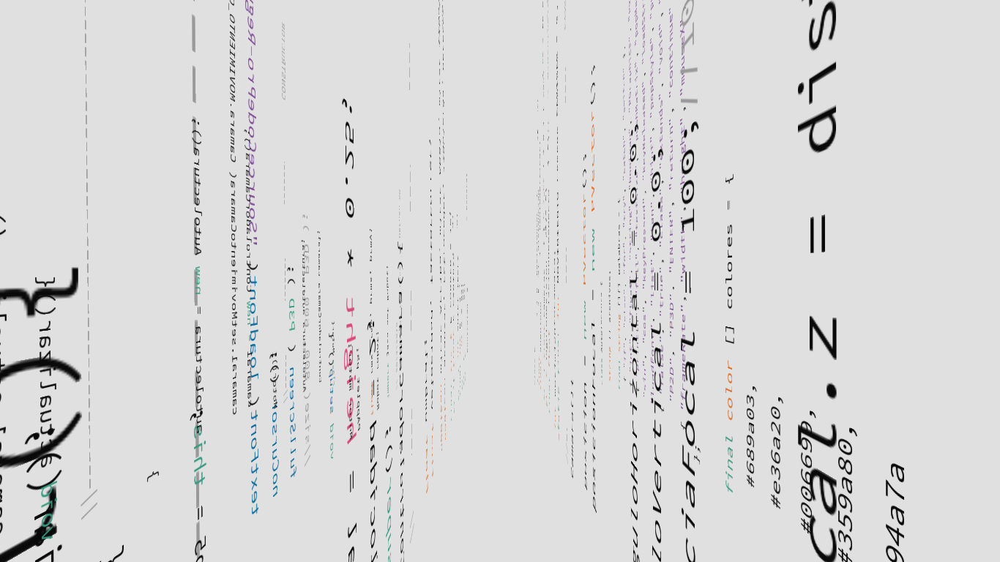

# Inside of the Code
Inside of the Code (2016) es una obra experimental y conceptual realizada con Processing. El código del programa tiene las instrucciones de leer su propio código fuente para mostrarlo en un espacio recorrible y en 3D. Es una obra conceptual, que invita a ver el “resultado” y el “cómo se hizo” al mismo tiempo.

## Video
https://vimeo.com/163540425

## Capturas de pantalla

